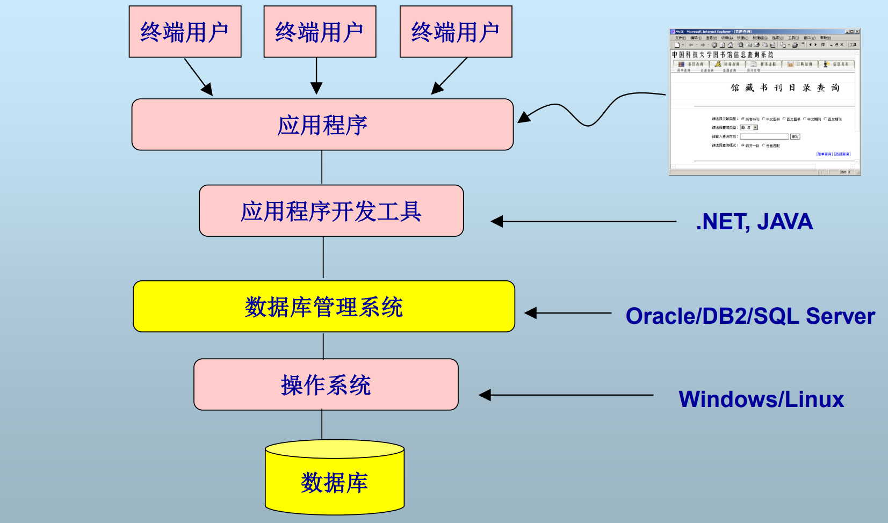

# 数据库系统

预备知识：

- 数据库系统原理（需补），SQL（需补），数据库应用编程
- C/C++/Java

# 概述

1. 数据库系统的基本概念
2. DBMS实现问题
3. 数据库设计问题
4. 数据库存取问题
5. 数据库技术的发展

## 基本概念

**数据**：数据是数据库中存储的基本对象，分为数值数据和非数值数据；

特点：数据和语义是不可分的

**数据库**：数据库是长期储存在计算机内、有组织的、可共享的大量数据的集合

基本特征：

- 数据按一定的数据模型组织、描述和储存
- 可为各种用户共享
- 数据间联系密切，具有**最小冗余度**和较高的独立性
- 服务与某个特定的应用

**数据库模式**：数据库中全体数据的逻辑结构和特征的描述

数据--------------->数据库

数据的语义------>数据库模式

**数据库管理系统（DBMS）**：计算机程序的集合，用于创建和维护数据库

- 位于操作系统和用户应用之间
- 总是基于某种数据模型
- 数据厂商的产品通常是指DBMS

**数据库系统（DBS）**：在计算机系统中 引入了数据库后的系统，即采用了数据库技术的计算机系统

### SQL的基本组成

- DDL：定义基本表、视图操作、索引操作
- DML：数据记录操作
- DCL：访问控制

### 课程重点

**DBMS实现问题**

至于数据库设计问题和存取问题则是前置课程要解决的问题，需要自己去补齐。

