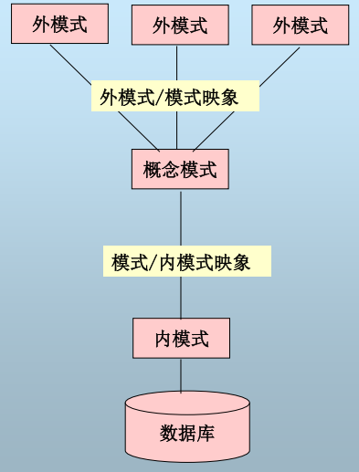

# 关系数据库回顾

## 数据库体系结构

数据库体系结构是从模式的角度来描述一般数据库系统的概念和结构，可以用于解释特定数据库系统的内部结构，ANSI/SPARC体系结构——三级模式结构＋两级映象

### 数据库模式的概念

**模式**：数据库中全体数据的逻辑结构和特征的描述，它仅仅涉及类型的描述，不涉及具体的值。

**实例**：模式的一个具体值称为模式的一个实例。

### 数据库的三级模式结构

- 外模式
- 概念模式
- 内模式

**外模式**：单个用户所看到的局部数据的逻辑结构和特征的描述；对用户而言，外模式就是数据库；建立在概念模式之上，同一模式可有多个不同的外模式；通过子模式DDL进行定义

**外部视图**：外模式的实例

**概念模式**：数据库中全体数据的逻辑结构和特征的描述 ，如：数据记录由哪些数据项构成；数据项的名字、类型、取值范围；数据之间的联系、数据的完整性等。

概念模式不涉及硬件环境，且一个数据库只有一个概念模式。通过模式DDL进行定义

**概念视图**：概念模式的实例

**内模式**：数据物理结构和存储方式的描述，如：记录的存储方式；索引按什么方式组织；数据是否加密？是否压缩存储？

内模式不涉及物理块（或页）的大小，也不考虑具体设备的柱面或磁道大小；和概念模式一样，一个数据库也仅有一个内模式；通过内模式DDL定义。

**内部视图**：内模式的实例

### 二级映象和数据独立性  

二级映象实现了三级模式结构直接按的联系和转换，这样就使得用户可以不必关注数据的底层表示方式和存储方式，逻辑化处理数据。

